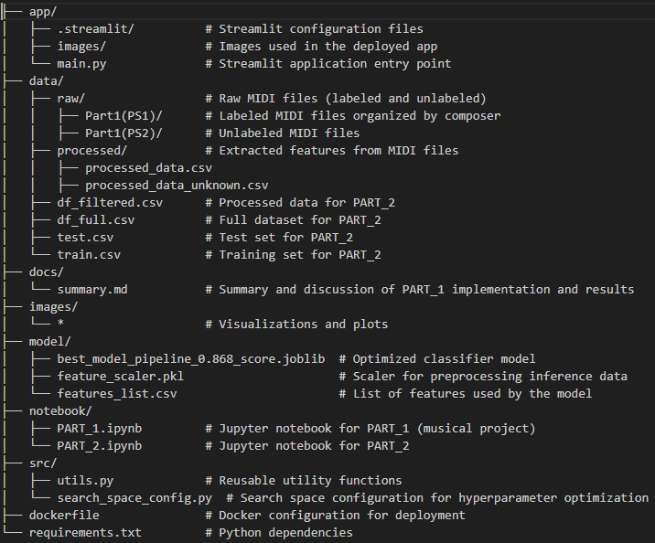
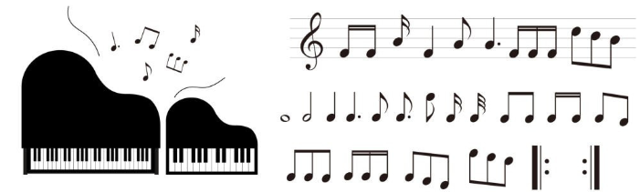
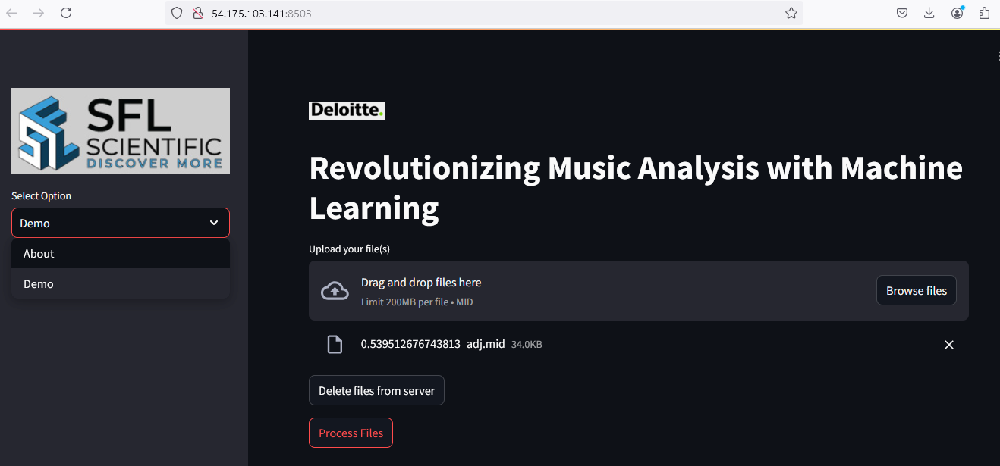

# README

## Deloitte Data Science Challenge Repository

This repository contains the implementation and solutions for the Deloitte Data Science Challenge, divided into two main parts:
- **PART_1**: A musical project focused on composer classification using machine learning.
- **PART_2**: Pandas Basics.

The repository is organized to ensure clarity and reproducibility, including the complete pipeline for data preprocessing, model training, and deployment.

## Repository Structure

## PART_1: Musical Project

### Objective

The goal of PART_1 is to build a machine learning pipeline capable of classifying MIDI files by their composers (Bach, Beethoven, Brahms, and Schubert) and identifying compositions that do not belong to any of these composers.

### Workflow
 - Feature Extraction: Musical attributes such as pitch, rhythm, harmony, and structure were extracted from MIDI files using music21.
 - Data Preprocessing: Missing values were handled, features were scaled, and irrelevant or highly correlated features were removed.
 - Model Training: A hyperparameter optimization pipeline was implemented to select the best-performing classifier. The final model, an ExtraTreesClassifier, achieved an accuracy of 86.8%.
- Deployment: A Streamlit application was built for inference, running on http://54.175.103.141:8503/.

### Results
The classifier effectively identifies the composer of most labeled files and flags unknown files using a probability threshold. Detailed discussions on implementation and results can be found in the ***docs/summary.md file***.

## PART_2: Data Science Challenge

PART_2 involves analyzing structured datasets to address a specific challenge, by manipulating the data using pandas. The notebook is in ***notebook/PART_2.ipynb file*** and the output files are in ***data/***

## Installation

To replicate the environment, install the required Python dependencies:

`pip install -r requirements.txt`

To run the Streamlit app locally:

`streamlit run app/main.py`

