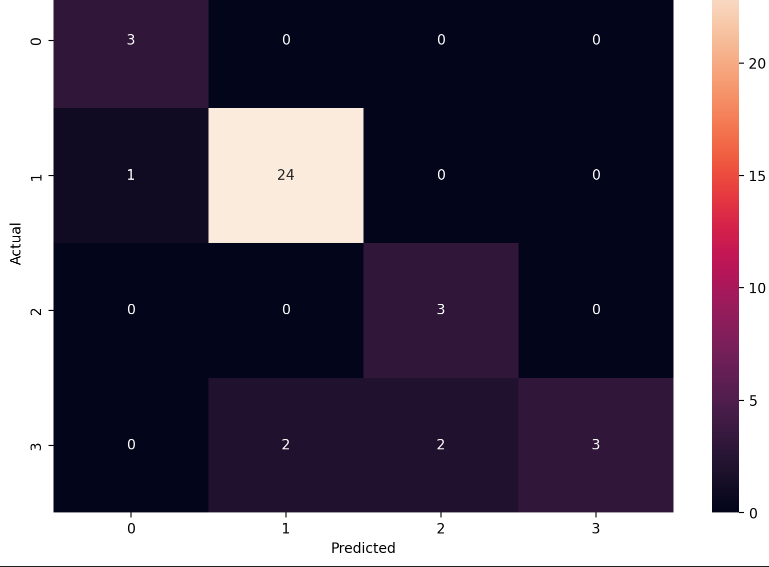
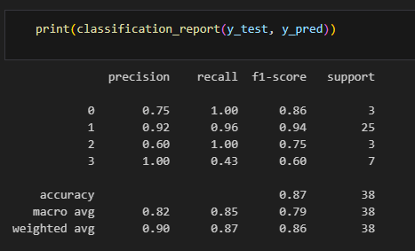
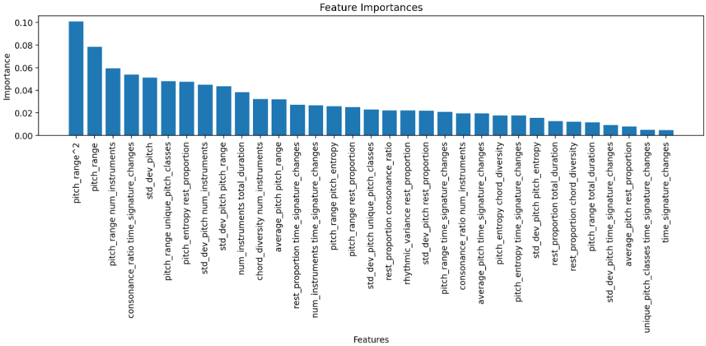

# Summary
## Introduction
Music has always been an intricate blend of art and mathematics, with each composer bringing a unique fingerprint of style and structure. From the intricate patterns of Bach's counterpoints to the dramatic contrasts of Beethoven's symphonies, every piece tells a story. Leveraging the power of machine learning, this project seeks to decode these musical fingerprints, enabling the classification of compositions by their composers and even identifying compositions outside the known repertoire. By analyzing the core attributes of MIDI files—pitch, rhythm, harmony, and structure—a model has been developed to classify musical works, capturing the essence of each composer’s distinct musical style. Through rigorous preprocessing, feature engineering, and hyperparameter optimization, the project aims to push the boundaries of how we interpret and analyze music through computational techniques.

## Data Preparation and Model Training 
The data preparation process involved extracting key features from MIDI files, including pitch, rhythm, harmony, and structural attributes, and performing extensive preprocessing. This included handling missing values, encoding categorical features, scaling numerical features, and removing low-variance and highly correlated features to improve model performance. A MinMaxScaler was applied to standardize the data, and the dataset was split into training and test sets.

For model training, a hyperparameter optimization pipeline was implemented using a search space encompassing multiple machine learning algorithms, including tree-based models, ensemble methods, and gradient boosting classifiers. Polynomial feature expansion and feature selection with SelectKBest were integrated into the pipeline. The best-performing model, an ExtraTreesClassifier with 60 estimators and a maximum depth of 19, was identified through cross-validation using negative log-loss as the evaluation metric. The optimized pipeline effectively balances complexity and performance for the classification task.

## Model Evaluation
The classification model achieved an overall accuracy of 86.8%, which indicates strong performance given the data constraints. The confusion matrix shows that the model performs particularly well on the majority class, Beethoven (class 1), correctly classifying 24 out of 25 samples. However, the model struggles with the minority classes, such as Brahms (class 2) and Schubert (class 3), where it exhibits lower recall and F1-scores. For instance, Brahms has a recall of 100%, meaning all actual Brahms samples were correctly identified, but its precision is only 60%, indicating that some predictions were incorrect.

 

The classification report provides deeper insights:

- Precision represents the proportion of correct predictions among all predictions made for a class. For Beethoven, the model achieves a precision of 92%, demonstrating high confidence in its predictions for this class.
- Recall measures the ability of the model to correctly identify all instances of a class. For Bach (class 0), the model achieves a perfect recall of 100%, but for Schubert (class 3), recall drops to 43%, indicating challenges in identifying all Schubert samples.
- F1-score, which balances precision and recall, is high for Beethoven (0.94) but lower for Schubert (0.60), reflecting the difficulty in consistently handling minority classes.

 

### Challenges and Observations
An analysis of the data distribution reveals class imbalance, with Beethoven (class 1) having 127 samples compared to only 17–25 samples for other composers. This imbalance likely influences the model's bias toward the majority class, as evidenced by the higher precision and recall for Beethoven. The lower scores for minority classes highlight the impact of limited training data, as well as possible overlaps in the feature space for the less-represented composers.

The model's ability to handle the minority classes could be improved by addressing the imbalance in the training data. Potential solutions include techniques such as oversampling the minority classes, data augmentation, or collecting additional data for the underrepresented composers. Additionally, incorporating more advanced algorithms or domain-specific feature engineering could further improve performance.

##  Discussion on Feature Importance
The analysis of feature importance reveals that the pitch-related features play a crucial role in predicting the composer of a sound. Specifically, derived features such as pitch_range^2, pitch_range, and interactions like pitch_range num_instruments and consonance_ratio pitch_range are among the top contributors to the model’s predictive performance. These features highlight how variations in pitch and the range of pitch values in a composition are strongly indicative of the composer’s unique style.

This importance is consistent with musical theory, as composers often have distinct preferences for pitch ranges and patterns. For instance, composers like Beethoven might exhibit wider pitch ranges to emphasize dramatic contrasts, while others like Bach may favor intricate and constrained harmonic structures. Other relevant features, such as time_signature_changes and consonance_ratio, further reflect the rhythmic and harmonic diversity that is characteristic of different composers. Together, these features suggest that the model effectively captures both melodic (pitch-related) and structural (instrumentation and rhythm) elements, leading to its ability to differentiate between composers accurately.

## Model on Inference Mode
The approach used for identifying files that do not belong to the known composers involved setting a probability threshold of 0.5. This threshold was applied to the maximum probabilities predicted for each sample. If the model's confidence in assigning a sample to one of the four composers was below this threshold, the sample was classified as "unknown." This method leverages the model's probabilistic predictions to distinguish between known and potentially unknown classes, ensuring that low-confidence predictions are flagged as outliers. During inference, the model classified 4 samples as "unknown" out of the total dataset, while the remaining samples were primarily attributed to Beethoven and Bach, with 16 and 11 predictions, respectively. Brahms and Schubert were less frequently predicted, with only 1 sample each.

While the threshold-based approach provides a straightforward and interpretable mechanism for handling unknown classes, it has some limitations. A fixed threshold, such as 0.5, may not optimally separate known and unknown classes, as low confidence could also result from noisy or ambiguous data within the known classes. The method could be improved by experimenting with different thresholds based on a validation set or by incorporating more advanced outlier detection algorithms, such as One-Class SVM or Isolation Forest, which can learn patterns specifically for identifying unknown data. Additionally, increasing the dataset size, particularly for the known composers, would enhance the model's ability to distinguish between known and unknown samples more effectively. Overall, the results demonstrate a reasonable starting point for classifying unknown files, but further refinements could improve the robustness of the approach.

## Conclusion
This project demonstrates how machine learning can unravel the complexities of music composition, providing a robust framework for classifying and analyzing musical works. The classification model achieved commendable accuracy, effectively identifying compositions by the four known composers while flagging unknown works through a probability-based approach. Despite challenges like data imbalance and limited training samples, the model's reliance on key musical attributes, such as pitch and rhythm, underscores the potential of AI to bridge the gap between data science and the art of music. Future improvements, including addressing data imbalance and refining the detection of unknown classes, could further enhance the model’s performance and adaptability, paving the way for broader applications in musicology and beyond.